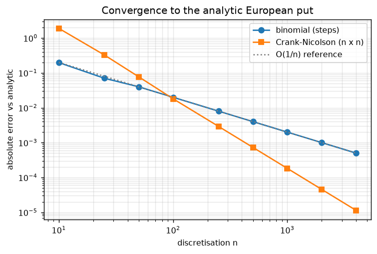
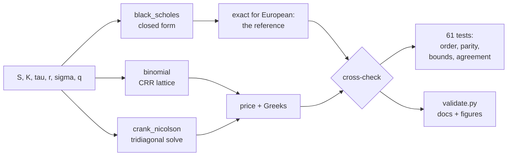
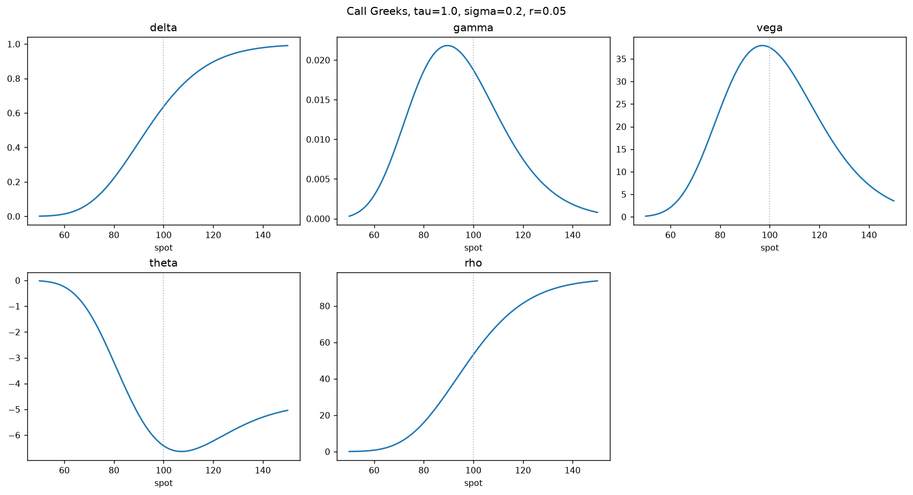
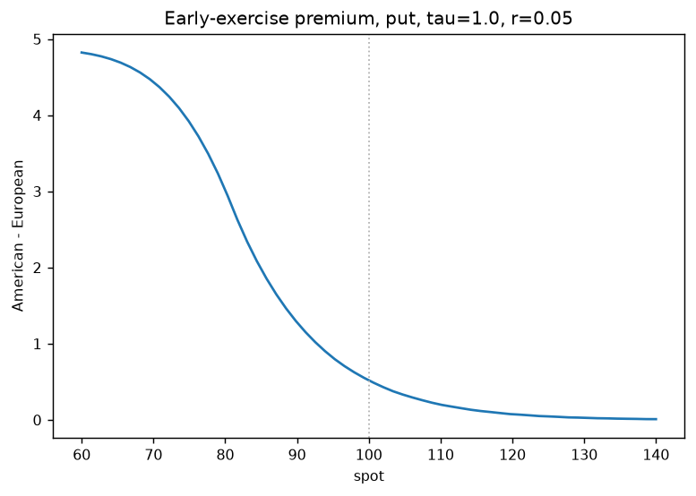

# Option Pricing: Analytic, Binomial and Finite-Difference

[](https://github.com/vincal848/options_pricing/actions/workflows/tests.yml)

This project came out of a final course project where I priced European and American
options using Hull's *Options, Futures and Other Derivatives* and Stefanica's *Primer
for the Mathematics of Financial Engineering*. The main method was binomial trees for
both exercise styles. I also attempted the finite-difference method as an alternative
and got blown-up values, so I removed it from the file — though I described the
process in the write-up and where I thought it had failed. Those derivations are now
in [docs/THEORY.md](docs/THEORY.md).

I have since rebuilt it. Two things came out of that. The finite-difference solver
now works and converges at its theoretical second order, and my diagnosis at the time
turned out to be correct — the problem was the explicit scheme with large time steps.
And the binomial code I had trusted was wrong in ways I could not have seen by
looking at the output, because it returned a plausible number for every input.
[What was wrong](#what-was-wrong) is the part of this repository I would actually
point someone at.



## At a glance

| | |
|---|---|
| **Methods** | Black-Scholes-Merton closed form; CRR binomial tree; Crank-Nicolson finite differences |
| **Instruments** | European and American calls and puts, with a continuous dividend yield |
| **Outputs** | Price, the five Greeks, implied volatility, early-exercise premium |
| **Validation** | 61 tests: published values, convergence order, put-call parity, dominance bounds, cross-method agreement |
| **Observed order** | Binomial 1.00, Crank-Nicolson 2.00 — measured, not assumed |
| **Stack** | Python, NumPy, SciPy |

Each method exposes the same `price(...)` and `greeks(...)` signature, which is the
point of the repository: the analytic formula is exact for European options, so it
pins the two numerical methods. For American options, where no closed form exists,
they are checked against each other and against bounds any correct implementation
has to satisfy.

## Results

Every number below is produced by [`validate.py`](validate.py), which regenerates
[docs/VALIDATION.md](docs/VALIDATION.md) and the figures here, so the documentation
cannot drift away from the code.

**European put, at the money** (S = K = 100, τ = 1y, r = 5%, σ = 20%; analytic value
5.5735260223):

| n | Binomial | error | n × error | Crank-Nicolson | error | n × error |
|---|---|---|---|---|---|---|
| 100 | 5.55355411 | 2.00e-02 | 1.997 | 5.55544750 | 1.81e-02 | 1.808 |
| 500 | 5.56952759 | 4.00e-03 | 1.999 | 5.57279734 | 7.29e-04 | 0.364 |
| 2000 | 5.57252623 | 1.00e-03 | 2.000 | 5.57348049 | 4.55e-05 | 0.091 |
| 4000 | 5.57302611 | 5.00e-04 | 2.000 | 5.57351464 | 1.14e-05 | 0.046 |

`n × error` is flat at 2.000 for the tree, so it is exactly first order. It keeps
halving for Crank-Nicolson, so that one is second order. Fitting the last four
refinements gives **1.00** and **2.00**.

**Greeks, at-the-money call**, as relative error against the analytic values:

| Greek | Analytic | Binomial (1500 steps) | Crank-Nicolson (600×600) |
|---|---|---|---|
| delta | 0.636831 | 3.3e-05 | 2.0e-05 |
| gamma | 0.018762 | 5.6e-04 | 7.9e-05 |
| vega | 37.524035 | 1.7e-04 | 5.0e-05 |
| theta | −6.414028 | 3.2e-04 | 4.0e-05 |
| rho | 53.232482 | 1.5e-05 | 6.3e-06 |

**American put**, where there is nothing exact to compare against:

| Quantity | Value |
|---|---|
| European put (analytic) | 5.573526 |
| American, binomial 2000 steps | 6.089990 |
| American, Crank-Nicolson 800×800 | 6.089325 |
| American, binomial 20000 steps (reference) | 6.090333 |
| Early-exercise premium | 0.516807 |

The two methods disagree by 6.6e-04 — two independent discretisations of the same
free-boundary problem landing in the same place. With no dividend the American call
equals the European call to machine zero, as it must, and the premium reappears once
the dividend yield exceeds the rate.

**Identities**, which hold for any parameters and so catch sign and factor errors:
put-call parity to 7.1e-15, `Δ_call − Δ_put = e^(−qτ)` to 1.1e-16, matching gamma and
vega to exactly zero, implied-vol round trip to 2.3e-11.

## What was wrong

The original returned a number for every input and those numbers looked like option
prices. Four separate defects only showed up once I checked the methods against
something rather than against my expectations.

**The risk-neutral probability was not a probability.** I had written it
`exp((r−q)·dt − d) / (u − d)`, subtracting the down-factor *inside* the exponential
instead of after it. That gives `p = 6.69` at 50 steps and `13.19` at 200, so the
price moved *away* from the truth as I added steps — an at-the-money put came out
2.79 at 50 steps and 1.40 at 200 against a true 5.57. Adding steps to a tree is the
one thing guaranteed to help, so a price that degrades under refinement is the
signature of a broken lattice. `crr_params` now refuses to return a `p` outside
(0, 1) instead of pricing with it.

**Early exercise was tested against the wrong row.** The backward induction compared
each node's continuation value against `price_tree[self.t, i]` — the period argument
the caller passed in — rather than the intrinsic value at the induction level `n`. So
every node in the tree was compared against one fixed row of the lattice. The
symptom is an American put worth *less* than its European counterpart, which is
impossible, since the American holder can always just decline to exercise early.

**Put rho had the wrong sign.** It came back positive, and a put loses value when
rates rise. Vega also carried an extra `1/√(2π)` on the call branch that the put
branch did not have, so the two disagreed with each other.

**Pricing could not be composed.** Each call ran `plt.show()` six times from inside
the pricing routine and ended in `return print(...)`, which returns `None`. The price
could not be fed into anything else — no implied vol, no surface, no test.

A fifth bug turned up in the *new* Crank-Nicolson solver while I was writing it, and
it is the one I learned most from. Both the current and the next time level's
boundary values were being added to the right-hand side, but the current level's
contribution was already in the explicit half of the product. The at-the-money price
stayed accurate to 1e-3 — a spot check passes — while the deep-in-the-money end of
the grid was wrong by about **88**. What caught it was asserting on the whole
solution instead of on the one number I cared about:

```python
# tests/test_numerical.py
def test_crank_nicolson_solution_is_monotone_and_convex_in_spot():
    s_nodes, values, _ = cn.solve(kind="call", n_space=400, n_time=400, **ATM)
    interior = values[1:-1]
    assert np.all(np.diff(interior) >= -1e-9), "call value must rise with spot"
    assert np.all(np.diff(interior, 2) >= -1e-6), "call value must be convex in spot"
```

Maximum error across the grid fell from 87.7 to 1.2e-03 once fixed.

## How it works



**Analytic.** Standard BSM with a continuous dividend yield, vectorised over NumPy
arrays so a whole surface prices in one call. Implied volatility is by bisection
rather than Newton, because vega collapses for deep out-of-the-money options and a
Newton step can jump clean out of the bracket.

**Binomial.** CRR, `u = exp(σ√dt)`, `d = 1/u`. Backward induction is vectorised one
level at a time rather than looping node by node.

**Crank-Nicolson.** The Black-Scholes PDE in time-to-expiry on a uniform spot grid,
with the spatial operator as a tridiagonal matrix and one `solve_banded` call per
time step. The grid is built so the valuation spot lands *exactly* on a node, which
means delta and gamma can be read straight off the solved solution instead of being
differenced through an interpolation — and they cost nothing extra, because the
neighbouring nodes were already computed.

## Decisions

- **Greeks from tree nodes, not from bumping the spot.** Rescaling `S` moves every
  lattice node, so the binomial price carries a sawtooth in `S` that a `1/h²`
  divisor amplifies: a 0.1% bump returns gamma = **0.265** against a true **0.0188**.
  Reading delta and gamma off the level-1 and level-2 nodes has no such term. A 5%
  bump also works, but only by being too coarse to see the noise.
  `test_gamma_is_not_swamped_by_lattice_noise` pins this.
- **Assert the convergence *rate*, not a tolerance.** Any single threshold is
  arbitrary and can pass for the wrong reasons. `n × error ≈ 2.0` at every
  refinement is a much stronger claim, and it is exactly what the original fails.
- **Time in years, steps as a separate argument.** The original used `N − t` as both
  a year count and a step count. Conflating them means changing the discretisation
  also silently changes the contract being priced.
- **Projection rather than PSOR for American options.** Applying the exercise
  constraint after each Crank-Nicolson step is the standard treatment (Hull ch.
  21.8). Solving the linear complementarity problem properly would move the price in
  the fourth decimal, which is what the 6.6e-04 cross-method gap reflects.
- **Plotting separated from pricing.** Pricing returns numbers.

## Quick start

```bash
pip install -r requirements.txt
```

```bash
python run.py compare -S 100 -K 100 -T 1 -r 0.05 -s 0.2
```

```
european call  S=100.0 K=100.0 tau=1.0 r=0.05 sigma=0.2 q=0.0
method                 price       delta       gamma        vega       theta         rho
analytic           10.450584    0.636831    0.018762   37.524035   -6.414028   53.232482
binomial           10.448584    0.636799    0.018778   37.514592   -6.417128   53.231290
crank-nicolson     10.449442    0.636802    0.018765   37.514662   -6.414612   53.231730

absolute error vs analytic
binomial            0.001999    0.000032    0.000016    0.009443    0.003100    0.001192
crank-nicolson      0.001142    0.000029    0.000003    0.009373    0.000585    0.000752
```

Other commands:

```bash
python run.py price -S 100 -K 100 -T 1 -r 0.05 -s 0.2 -k put -e american
python run.py converge -S 100 -K 100 -T 1 -r 0.05 -s 0.2
python run.py iv --price 10.4506 -S 100 -K 100 -T 1 -r 0.05 -k call
```

From Python:

```python
import black_scholes as bs
import binomial

bs.price(100, 100, 1.0, 0.05, 0.2, "call")                         # 10.450583572
binomial.price(100, 100, 1.0, 0.05, 0.2, "put",
               n_steps=2000, exercise="american")                   # 6.089990
```

Reproduce the documentation:

```bash
pytest tests -q      # 61 tests
python validate.py   # regenerates docs/VALIDATION.md and docs/img/
```

## Repository guide

| Path | Contents |
|---|---|
| `black_scholes.py` | Closed-form price, Greeks, implied volatility |
| `binomial.py` | CRR tree, European and American, node-based Greeks |
| `crank_nicolson.py` | Finite-difference solver over the whole grid |
| `plots.py` | Figures. Kept out of the pricing path |
| `run.py` | `price`, `compare`, `converge`, `iv` |
| `validate.py` | Regenerates `docs/VALIDATION.md` and `docs/img/` |
| `tests/` | 61 tests, including a named regression for each defect above |
| `docs/THEORY.md` | My original derivations: BSM from the stock process, the tree, the Crank-Nicolson discretisation |
| `docs/VALIDATION.md` | Full tables: prices, convergence, Greeks, identities, cost |
| `legacy/option_model.py` | The original file, annotated. Not imported; known broken |





*What the right to exercise early is worth: American minus European put value across
spot. It is largest in the money, where exercising and banking the strike beats
holding, and decays to zero far out of the money.*

## Future interests

- **Dividend schedules** — discrete cash dividends, not just a continuous yield.
- **PSOR for the American free boundary**, to replace projection and put a number on
  the gap.
- **Trinomial trees**, and Richardson extrapolation on the binomial to lift it to
  second order.
- **Barrier and Asian payoffs**, where the finite-difference grid has a real
  advantage over the closed form and the tree.
- **A volatility surface fit**, using the implied-vol solver across strikes and
  maturities. This is the piece that would connect the repository to market data
  rather than to textbook parameters.

## Notes

- References are Hull, *Options, Futures and Other Derivatives* (ch. 15, 19, 21) and
  Stefanica, *A Primer for the Mathematics of Financial Engineering* (ch. 3-4).
  Chapter numbers in the source refer to these.
- Convention: `tau` is in years, `sigma` and `r` are continuously compounded annual
  rates, vega and rho are per 1.00 (divide by 100 for the per-percentage-point
  figures brokers quote), and theta is per year (divide by 365 for per-day).
- Timings in [docs/VALIDATION.md](docs/VALIDATION.md) are single-core on one machine
  and are there for the relative comparison rather than as a benchmark.
