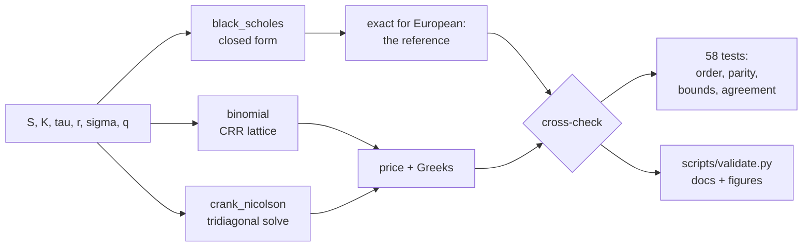

# Option Pricing: Analytic, Binomial and Finite-Difference

[](https://github.com/vincal848/options_pricing/actions/workflows/tests.yml)

Three independent ways to price European and American options — the closed-form
Black-Scholes-Merton solution, a Cox-Ross-Rubinstein binomial tree, and a
Crank-Nicolson finite-difference solver — each exposing the same interface so they
can be checked against one another. The analytic price is exact for European
options, so it is the reference that pins the two numerical methods. For American
options, where no closed form exists, the methods are cross-checked against each
other and against bounds that any correct implementation must satisfy.

This began as a coursework project and has been rebuilt. The numerical methods were
wrong in ways a price-only spot check does not reveal, and the finite-difference
solver the original write-up described at length but never shipped now exists and
converges at its theoretical order. [What was wrong, and how it was found](#what-was-wrong),
is the most useful part of this repository.


## At a glance

| | |
|---|---|
| **Methods** | Black-Scholes-Merton closed form; CRR binomial tree; Crank-Nicolson finite differences |
| **Instruments** | European and American calls and puts, with a continuous dividend yield |
| **Outputs** | Price, the five Greeks, implied volatility, early-exercise premium |
| **Validation** | 58 tests: published values, convergence order, put-call parity, dominance bounds, cross-method agreement |
| **Observed order** | Binomial 1.00, Crank-Nicolson 2.00 — measured, not assumed |
| **Stack** | Python, NumPy, SciPy, Typer |

## Results

Every number below comes from [`scripts/validate.py`](scripts/validate.py), which
regenerates [docs/VALIDATION.md](docs/VALIDATION.md) and the figures here, so the
documentation cannot drift from the code.

**European put, at the money** (S = K = 100, τ = 1y, r = 5%, σ = 20%; analytic value
5.5735260223):

| n | Binomial | error | n × error | Crank-Nicolson | error | n × error |
|---|---|---|---|---|---|---|
| 100 | 5.55355411 | 2.00e-02 | 1.997 | 5.55544750 | 1.81e-02 | 1.808 |
| 500 | 5.56952759 | 4.00e-03 | 1.999 | 5.57279734 | 7.29e-04 | 0.364 |
| 2000 | 5.57252623 | 1.00e-03 | 2.000 | 5.57348049 | 4.55e-05 | 0.091 |
| 4000 | 5.57302611 | 5.00e-04 | 2.000 | 5.57351464 | 1.14e-05 | 0.046 |

`n × error` is flat at 2.000 for the tree, so it is exactly first order. It keeps
halving for Crank-Nicolson, so that one is second order. Fitting the last four
refinements gives **1.00** and **2.00**.

**Greeks, at-the-money call**, as relative error against the analytic values:

| Greek | Analytic | Binomial (1500 steps) | Crank-Nicolson (600×600) |
|---|---|---|---|
| delta | 0.636831 | 3.3e-05 | 2.0e-05 |
| gamma | 0.018762 | 5.6e-04 | 7.9e-05 |
| vega | 37.524035 | 1.7e-04 | 5.0e-05 |
| theta | −6.414028 | 3.2e-04 | 4.0e-05 |
| rho | 53.232482 | 1.5e-05 | 6.3e-06 |

**American put**, where there is nothing exact to compare against:

| Quantity | Value |
|---|---|
| European put (analytic) | 5.573526 |
| American, binomial 2000 steps | 6.089990 |
| American, Crank-Nicolson 800×800 | 6.089325 |
| American, binomial 20000 steps (reference) | 6.090333 |
| Early-exercise premium | 0.516807 |

The two methods disagree by 6.6e-04 — independent discretisations of the same
free-boundary problem landing in the same place. With no dividend the American call
equals the European call to machine zero, as it must, and the premium reappears once
the dividend yield exceeds the rate.

**Identities**, which hold for any parameters and so catch sign and factor errors:
put-call parity to 7.1e-15, `Δ_call − Δ_put = e^(−qτ)` to 1.1e-16, matching gamma and
vega to exactly zero, implied-vol round trip to 2.3e-11.

## What was wrong

The original implementation returned a number for every input, and the numbers looked
like option prices. Four separate defects were visible only once the methods were
checked against something.

**The risk-neutral probability was not a probability.** It was written
`exp((r−q)·dt − d) / (u − d)`, subtracting the down-factor *inside* the exponential
instead of after it. The result was `p = 6.69` at 50 steps and `13.19` at 200, so the
price moved *away* from the truth as steps were added: an at-the-money put came out
2.79 at 50 steps and 1.40 at 200, against a true 5.57. Adding steps to a tree is the
one thing guaranteed to help, so a price that degrades under refinement is the
signature of a broken lattice.

**Early exercise was tested against the wrong row.** The backward induction compared
each node's continuation value against `price_tree[self.t, i]` — the period argument
passed in by the caller — rather than against the intrinsic value at the induction
level `n`. Every node in the tree was therefore compared against one fixed row of the
lattice. The observable symptom is an American put worth *less* than its European
counterpart, which is impossible: the American holder can always decline to exercise
early.

**Put rho had the wrong sign,** returning a positive number. A put loses value when
rates rise. Vega was also computed with an extra `1/√(2π)` on the call branch but not
the put branch, so the two branches disagreed with each other.

**Pricing could not be composed.** Each call ran `plt.show()` six times from inside
the pricing routine and ended in `return print(...)`, which returns `None`. A price
could not be fed into anything else — no implied vol, no surface, no test.

A fifth bug appeared in the *new* Crank-Nicolson solver during this rebuild, and it is
the most instructive of the five. Both the current and the next time level's boundary
values were being added to the right-hand side, but the current level's contribution
was already present in the explicit half of the product. The at-the-money price stayed
accurate to 1e-3 — a spot check passes — while the deep-in-the-money end of the grid
was wrong by about **88**. What caught it was asserting on the whole solution rather
than on the one number of interest:

```python
# tests/test_numerical.py
def test_crank_nicolson_solution_is_monotone_and_convex_in_spot():
    s_nodes, values, _ = cn.solve(kind="call", n_space=400, n_time=400, **ATM)
    interior = values[1:-1]
    assert np.all(np.diff(interior) >= -1e-9), "call value must rise with spot"
    assert np.all(np.diff(interior, 2) >= -1e-6), "call value must be convex in spot"
```

Maximum error across the grid fell from 87.7 to 1.2e-03 once fixed.

## How it works



**Analytic.** Standard BSM with a continuous dividend yield, vectorised over NumPy
arrays so a whole surface prices in one call. Implied volatility is by bisection
rather than Newton, because vega collapses for deep out-of-the-money options and a
Newton step can leave the bracket entirely.

**Binomial.** CRR parameterisation, `u = exp(σ√dt)`, `d = 1/u`. Backward induction is
vectorised one level at a time. `crr_params` refuses to return a `p` outside (0,1)
rather than pricing with it, which is the guard the original lacked.

**Crank-Nicolson.** The Black-Scholes PDE in time-to-expiry on a uniform spot grid,
with the spatial operator as a tridiagonal matrix and one `solve_banded` call per
time step. Unconditionally stable, second order in both dimensions. The grid is
constructed so the valuation spot lands *exactly* on a node, which means delta and
gamma are read directly off the solved solution rather than differenced through an
interpolation — and they cost nothing extra, because the neighbouring nodes were
already computed.

## Decisions

- **Greeks from tree nodes, not from bumping the spot.** Rescaling `S` moves every
  lattice node, so the binomial price carries a sawtooth in `S` that a `1/h²` divisor
  amplifies: a 0.1% bump returns gamma = **0.265** against a true **0.0188**. Reading
  delta and gamma off the level-1 and level-2 nodes has no such term. A 5% bump also
  works, but only by being too coarse to see the noise.
  `test_gamma_is_not_swamped_by_lattice_noise` pins this.
- **Assert the convergence *rate*, not a tolerance.** Any single threshold is
  arbitrary and can pass for the wrong reasons. `n × error ≈ 2.0` at every refinement
  is a far stronger claim, and it is exactly what the original code fails.
- **Time in years, steps as a separate argument.** The original used `N - t` as both a
  year count and a step count. Conflating them means changing the discretisation also
  silently changes the contract being priced.
- **Projection rather than PSOR for American options.** Applying the exercise
  constraint after each Crank-Nicolson step is the standard treatment (Hull ch. 21.8).
  Solving the linear complementarity problem properly would change the price in the
  fourth decimal here, which is what the 6.6e-04 cross-method gap reflects.
- **Plotting separated from pricing.** Pricing returns numbers.

## Quick start

```bash
pip install -e ".[dev]"
```

```bash
options compare -S 100 -K 100 -T 1 -r 0.05 -s 0.2
```

```
european call  S=100.0 K=100.0 tau=1.0 r=0.05 sigma=0.2 q=0.0
method                 price       delta       gamma        vega       theta         rho
analytic           10.450584    0.636831    0.018762   37.524035   -6.414028   53.232482
binomial           10.448584    0.636799    0.018778   37.514592   -6.417128   53.231290
crank-nicolson     10.449442    0.636802    0.018765   37.514662   -6.414612   53.231730

absolute error vs analytic
binomial            0.001999    0.000032    0.000016    0.009443    0.003100    0.001192
crank-nicolson      0.001142    0.000029    0.000003    0.009373    0.000585    0.000752
```

Other commands:

```bash
options price -S 100 -K 100 -T 1 -r 0.05 -s 0.2 -k put -e american   # American, binomial
options converge -S 100 -K 100 -T 1 -r 0.05 -s 0.2                   # error vs discretisation
options iv --price 10.4506 -S 100 -K 100 -T 1 -r 0.05 -k call        # implied volatility
```

From Python:

```python
from options_pricing import black_scholes, binomial, compare

black_scholes.price(100, 100, 1.0, 0.05, 0.2, "call")     # 10.450583572
binomial.price(100, 100, 1.0, 0.05, 0.2, "put",
               n_steps=2000, exercise="american")          # 6.089990
compare(100, 100, 1.0, 0.05, 0.2, "call")                  # all three methods
```

Reproduce the documentation:

```bash
pytest                      # 58 tests
python scripts/validate.py  # regenerates docs/VALIDATION.md and docs/img/
```

## Repository guide

| Path | Contents |
|---|---|
| `src/options_pricing/black_scholes.py` | Closed-form price, Greeks, implied volatility |
| `src/options_pricing/binomial.py` | CRR tree, European and American, node-based Greeks |
| `src/options_pricing/crank_nicolson.py` | Finite-difference solver over the whole grid |
| `src/options_pricing/plots.py` | Figures. Kept out of the pricing path |
| `src/options_pricing/cli.py` | `options price`, `compare`, `converge`, `iv` |
| `tests/` | 58 tests, including a named regression for each defect above |
| `scripts/validate.py` | Regenerates `docs/VALIDATION.md` and `docs/img/` |
| `docs/THEORY.md` | Derivations: BSM from the stock process, the CRR tree, the Crank-Nicolson discretisation |
| `docs/VALIDATION.md` | Full tables: prices, convergence, Greeks, identities, cost |
| `legacy/option_model.py` | The original coursework file, kept for reference. Not imported; known broken |


*What the right to exercise early is worth: American minus European put value across
spot. It is largest in the money, where exercising and banking the strike beats
holding, and decays to zero far out of the money.*

## Roadmap

- Dividend **schedules** — discrete cash dividends, not only a continuous yield.
- PSOR for the American free boundary, to replace projection and quantify the gap.
- Trinomial trees, and Richardson extrapolation on the binomial to lift it to second
  order.
- Barrier and Asian payoffs, where the finite-difference grid has a real advantage
  over the closed form.
- A volatility surface fit, using the existing implied-vol solver across strikes.

## Notes

- References are Hull, *Options, Futures and Other Derivatives* (chapters 15, 19, 21)
  and Stefanica, *A Primer for the Mathematics of Financial Engineering* (chapters
  3-4). Chapter numbers cited in the source refer to these.
- Convention: `tau` is in years, `sigma` and `r` are continuously compounded annual
  rates, vega and rho are per 1.00 (divide by 100 for the per-percentage-point figures
  brokers quote), and theta is per year (divide by 365 for per-day).
- Timings in [docs/VALIDATION.md](docs/VALIDATION.md) are single-core on one machine,
  and are there for the relative comparison rather than as a benchmark.
